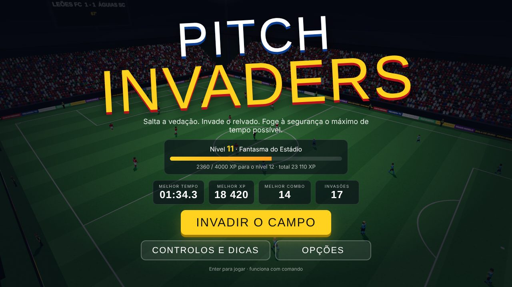
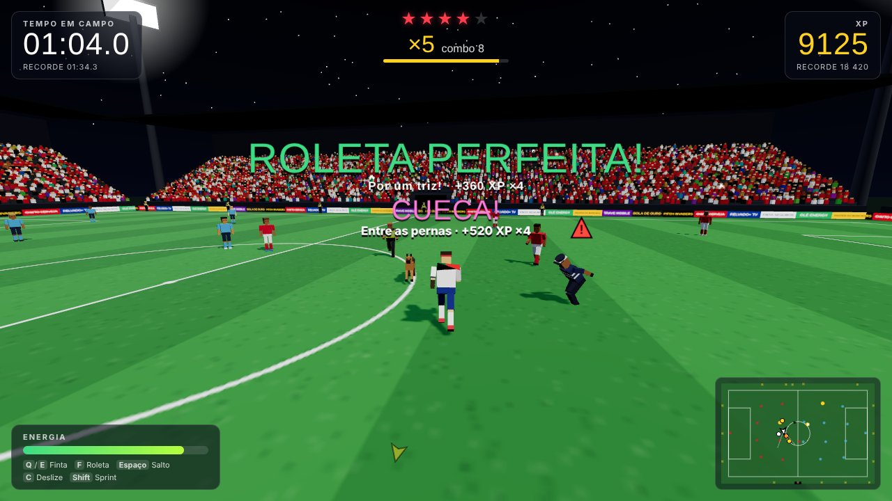

# ⚽ Pitch Invaders

Salta a vedação a meio de um jogo de futebol, invade o relvado e **foge da segurança o máximo de tempo possível**.
Jogo 3D na terceira pessoa: fintas, roletas, saltos e deslizes valem **XP**. O objetivo é bater o recorde de tempo em campo sem ser apanhado.




---

## ▶️ Como jogar

### Windows (3 passos)

1. **[⬇️ Descarregar o Pitch Invaders](https://github.com/ro0mk/PitchInvaders/raw/HEAD/PitchInvaders.zip)** (ficheiro ZIP com menos de 1 MB)
2. Na pasta **Transferências**, clica com o botão direito em `PitchInvaders.zip` (pode aparecer só como `PitchInvaders`) → **Extrair Tudo…** → **Extrair**.
3. Na pasta `PitchInvaders` que se abre, faz duplo clique em **Jogar**, o ficheiro com o ícone verde do jogo (o nome completo é `Jogar.exe`). Pronto!

O jogo abre numa janela própria. Não é preciso instalar nada: o `Jogar.exe` usa o Chrome, se o tiveres, ou o Edge, que já vem com o Windows.

> - Na primeira vez pode aparecer um aviso azul do Windows a dizer que **protegeu o PC**. Acontece com qualquer programa novo sem assinatura digital: carrega em **Mais informações → Executar mesmo assim**.
> - Se o Windows bloquear o `Jogar.exe` sem mostrar **Executar mesmo assim** (acontece com o *Smart App Control* ligado ou no Windows em *modo S*), abre a pasta `dist` e faz duplo clique em `PitchInvaders.html`: o jogo abre no browser.
> - Se aparecer a mensagem "Não encontrei o ficheiro do jogo", é porque abriste o `Jogar.exe` sem extrair o ZIP: faz o passo 2 primeiro. Não tires o `Jogar.exe` da pasta, porque ele abre o jogo que está em `dist`.
> - O `Jogar-Mac-Linux.command` é só para Mac e Linux: no Windows podes ignorá-lo.

### Mac

1. **[⬇️ Descarregar o Pitch Invaders](https://github.com/ro0mk/PitchInvaders/raw/HEAD/PitchInvaders.zip)**. O Safari costuma extrair o ZIP sozinho; se não, faz duplo clique em `PitchInvaders.zip`.
2. Na pasta `PitchInvaders`, abre a pasta `dist` e faz duplo clique em **`PitchInvaders.html`**. O jogo abre no Safari (ou no teu browser predefinido). Pronto!

**Queres o jogo numa janela própria, sem barra de endereço?** Usa o `Jogar-Mac-Linux.command` (precisa do Chrome, do Edge ou do Brave instalado):

1. Faz duplo clique em `Jogar-Mac-Linux.command`. Na primeira vez o Mac bloqueia-o: carrega em **Concluído** (não escolhas **Mover para o Lixo**).
2. Abre **Definições do Sistema → Privacidade e segurança**, desce até **Segurança** e carrega em **Abrir na mesma** ao lado de `Jogar-Mac-Linux.command`. Confirma com **Abrir na mesma** e a palavra-passe do Mac.
3. A partir daí basta duplo clique. (No macOS 14 ou anterior chega fazer Controlo + clique no ficheiro → **Abrir** → **Abrir**.)

### Linux

Descarrega e extrai o [ZIP](https://github.com/ro0mk/PitchInvaders/raw/HEAD/PitchInvaders.zip) e corre `./Jogar-Mac-Linux.command` dentro da pasta (ou abre `dist/PitchInvaders.html` no browser).

### Sem executável (qualquer computador)

O jogo inteiro é um único ficheiro, `PitchInvaders.html`, que está na pasta `dist` do [ZIP](https://github.com/ro0mk/PitchInvaders/raw/HEAD/PitchInvaders.zip). Abre-o com duplo clique: abre no teu browser (Chrome, Edge, Firefox ou Safari) e funciona sem internet.

Se quiseres só esse ficheiro, abre [dist/PitchInvaders.html](dist/PitchInvaders.html) aqui no GitHub e carrega no botão **Download raw file** (a seta ⬇ por cima do código, à direita).

> Os recordes ficam guardados no browser em que jogas. Se mudares de browser, começas do zero.

---

## Outras formas de jogar

### App de ambiente de trabalho (Electron)

O GitHub Actions gera também uma app completa a cada push (workflow **Executáveis**). Abre o separador **Actions** → **Executáveis** → a execução mais recente e, em **Artifacts**, descarrega:

- **PitchInvaders-Windows**: `PitchInvaders-1.0.0-portable.exe` (corre sem instalar) ou `PitchInvaders-1.0.0-setup.exe` (instalador)
- **PitchInvaders-Linux**: `PitchInvaders-1.0.0-linux-x86_64.AppImage` (`chmod +x` e executa)
- **PitchInvaders-macOS**: `.dmg`
- **PitchInvaders-simples**: o `PitchInvaders.zip` (o mesmo do link de download do topo)

Se criares uma tag `v*` (por exemplo `v1.0.0`), estes ficheiros são publicados numa **Release**.

### A partir do código

```bash
npm install
npm start               # gera o jogo e abre-o na app de ambiente de trabalho (Electron)
npm run build           # só gera dist/PitchInvaders.html
npm run build:launcher  # recompila o Jogar.exe (precisa do MinGW-w64)
npm run pacote          # atualiza o PitchInvaders.zip e o Jogar.exe (corre sempre depois de mudar o jogo)
npm run dist:win        # gera os .exe do Electron (corre no Windows)
npm run dist:linux      # gera o AppImage
npm run dist:mac        # gera o .dmg (corre no macOS)
```

---

## Controlos

| Tecla | Ação |
|---|---|
| `W` `A` `S` `D` | Correr |
| Rato / `←` `→` | Rodar a câmara (clica no ecrã para capturar o rato) |
| `Shift` | Sprint (gasta energia) |
| `Q` / `E` | **Finta** para a esquerda / direita |
| `F` / botão direito | **Roleta**: és invencível durante o giro |
| `Espaço` | **Salto**: passas por cima das placagens |
| `C` | **Deslize**: passas por baixo dos agarrões |
| `T` | Selfie com um craque ★ |
| `Esc` / `P` | Pausa |
| `F11` | Ecrã inteiro (na app) |

**Comando (Xbox/PlayStation):** stick esquerdo corre, stick direito roda a câmara, A salto, B deslize, X roleta, LB/RB finta, RT sprint, Y selfie, Start pausa.

---

## Perseguidores

Antes de cada ataque aparece um **!** por cima da cabeça do perseguidor. Tens uma fração de segundo para reagir com o truque certo.

| Perseguidor | Ataque | Contra-ataque ideal | Aparece |
|---|---|---|---|
| 🟡 **Segurança** (colete amarelo) | Agarrão (alto) | **Deslize**, Roleta ou Finta | desde o início, em postos à volta do campo |
| 🔴 **Polícia** (farda azul) | Placagem em voo (baixo) | **Salto**, Roleta ou Finta | a partir do nível de alerta 2 |
| 🟠 **Cão polícia** | Salto (alto) | **Roleta**, Finta ou Deslize | a partir do nível de alerta 4 |

- O **nível de alerta** (★ no topo do ecrã) sobe a cada ~28 s e quando fazes combos enormes. Cada nível traz mais perseguidores, mais rápidos.
- Se te agarrarem, carrega **Espaço** repetidamente para fugir. Se outro perseguidor chegar antes de te libertares, foste apanhado. Cada fuga torna a seguinte mais difícil.
- A **energia** gasta-se com o sprint e com os truques. Se a esgotares ficas mais lento até recuperares.
- O radar (canto inferior direito) e as setas nos cantos do ecrã mostram quem vem atrás de ti.

---

## XP

| Jogada | XP base |
|---|---|
| Esquiva simples (o ataque falha) | 30 |
| Finta / Roleta / Salto / Deslize no momento do ataque | 60 / 90 / 80 / 80 |
| **PERFEITO**: o truque salvou-te mesmo no último instante | ×2 + câmara lenta |
| Por um triz (a menos de 0,9 m) | ×1,4 |
| Dupla esquiva (dois ataques seguidos) | +60 |
| **Cueca**: deslizar entre as pernas de um segurança | 130 |
| **Chapéu**: saltar por cima de um polícia | 130 |
| **Choque**: dois perseguidores chocam um contra o outro | 150 |
| Tropeção: um perseguidor placa um jogador | 100 |
| Tornozelos partidos: a finta deita o segurança ao chão | 40 |
| Rasante: passar a correr colado a um perseguidor | 15 |
| **Golo**: chutar a bola para a baliza | 500 |
| **Selfie** com um craque ★ | 250 |
| Escapar de um agarrão | 200 |
| Sobreviver | 2 + 1,5 × nível de alerta por segundo |

- **Combo:** cada jogada seguida (com menos de 4,5 s de intervalo) sobe o multiplicador, de ×1 até **×8**. Se te agarrarem, o combo volta a zero.
- **Variedade:** repetir o mesmo truque rende menos (70 %, 50 %, 35 %), por isso vale a pena alternar.
- **Recordes** de tempo, XP e combo ficam guardados. Todo o XP conta para o teu **nível de carreira**, de *Adepto de Bancada* até *Imparável*.

---

## Estrutura do projeto

```
Jogar.exe           lançador para Windows (abre o jogo numa janela própria)
Jogar-Mac-Linux.command   lançador para macOS e Linux
PitchInvaders.zip   pasta pronta a jogar (Jogar.exe + jogo), o download do topo deste README
dist/PitchInvaders.html   o jogo completo num único ficheiro
src/
  main.js       estado do jogo, eventos, XP e recordes
  player.js     invasor: movimento, energia, truques, luta para fugir
  enemies.js    seguranças, polícias e cães: perseguição, ataques, dificuldade
  match.js      jogadores, árbitro e bola (simulação do jogo + golos)
  stadium.js    relvado, balizas, bancadas com público animado, holofotes, ecrã gigante
  character.js  modelos low-poly e animações procedurais
  camera.js     câmara em 3.ª pessoa
  hud.js        HUD, radar, setas de aviso e popups
  scoring.js    XP, combos e estatísticas
  audio.js      som sintetizado (público, apito, efeitos)
  input.js      teclado, rato e comando
launcher/           código e recursos do Jogar.exe (jogar.c, ícone, LEIA-ME.txt)
electron/main.cjs   app de ambiente de trabalho
scripts/build.mjs   junta tudo num único dist/PitchInvaders.html
```

Feito com [three.js](https://threejs.org/) e [Electron](https://www.electronjs.org/). Todos os gráficos e sons são gerados por código: não há ficheiros externos.
